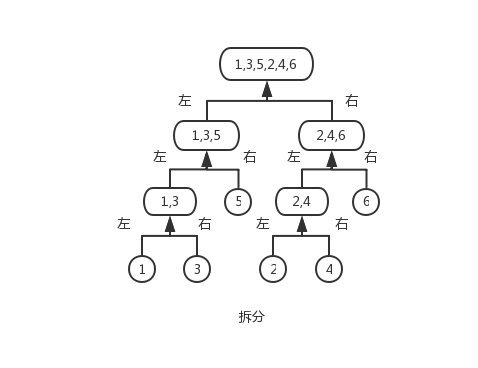

## 计算数组的小和

### 【题目】
数组小和的定义如下：

数组 s = [ 1, 3, 5, 2, 4, 6 ] ， 在s[0]的左边小于等于s[0]的数的和为0，在s[1]的左边小于等于s[1]的数的和为1；在s[2]的左边小于等于s[2]的数的和为1+3=4，... ，在s[5]的左边小于等于s[5]的数的和为1+3+5+2+4=15，则s的小和为：0+1+4+...+15=27。

给定一个数组s，求出s的小和。

### 【要求】
时间复杂度O(NlogN)，额外空间复杂度O(N)。

### 【解答】
通过归并排序的方式拆分合并数组得到小和：

### 【代码】
[1.11getSmallSum.js](../codes/1.11getSmallSum.js)