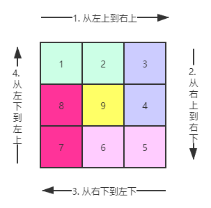

## 打印螺旋矩阵

### 【题目】
给定一个正整数 n，生成一个包含 1 到 n^2 所有元素，且元素按顺时针顺序螺旋排列的正方形矩阵。

示例:

输入: 3 
输出: [ [ 1, 2, 3 ], [ 8, 9, 4 ], [ 7, 6, 5 ] ]


### 【解答】
模拟顺时针画矩阵的过程：
- 从左上到右上 -> 从右上到右下 -> 从右下到左下 -> 从左下到左上；
- 为了避免头尾重复，每条边都左闭右开；



### 【代码】
```javascript
var generateMatrix = function(n) {
	// 初始化二维数组
	const ans = new Array();
	for(var i=0; i<n; i++) {
		ans[i] = new Array(); 
		for(var j=0; j<n; j++) {
			ans[i][j] = 0;
		}
	}

	let count = 1; // 不断累计值
	let start = 0; // 第几层圈
	for(let i = 0; i < Math.ceil(n/2); i++) {
		// 如果n为奇数，圈最中间只有一个数，不用循环求值
		if (i === (Math.ceil(n/2)-1) && n%2=== 1) {
			ans[Math.floor(n/2)][Math.floor(n/2)] = count++;
			break;
		} 
		// 从左上到右上
		for (let j = start; j < n-i-1; j++) {
			ans[i][j] = count++;
		}
		// 从右上到右下
		for (let j = start; j < n-i-1; j++) {
			ans[j][n-i-1] = count++;
		}
		// 从右下到左下
		for (let j = start; j < n-i-1; j++) {
			ans[n-i-1][n-j-1] = count++;
		}
		// 从左下到左上
		for (let j = start; j < n-i-1; j++) {
			ans[n-j-1][i] = count++;
		}
		start++;
	}
	return ans;
}


console.log(generateMatrix(2))
```

