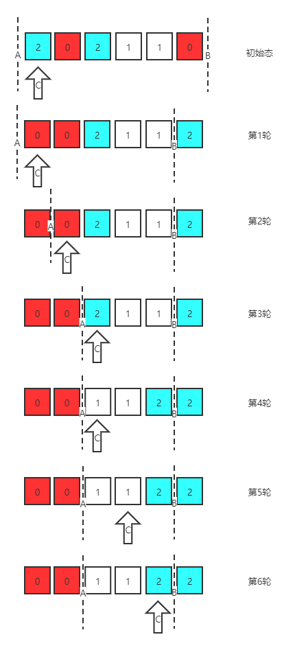

## 8.2 颜色分类（LeetCode 75）

### 【题目】
给定一个包含红色、白色和蓝色，一共 n 个元素的数组，原地对它们进行排序，使得相同颜色的元素相邻，并按照红色、白色、蓝色顺序排列。使用整数 0、 1 和 2 分别表示红色、白色和蓝色。

**注意：**不能使用代码库中的排序函数来解决这道题。

**示例1：**

```js
输入：[2,0,2,1,1,0]
输出：[0,0,1,1,2,2]
```

**示例2：**

```js
输入：[2,0,1]
输出：[0,1,2]
```


### 【解答】

1. 三种颜色，需要两条分割线，A线左侧为0，右侧为1；B线左侧为1，右侧为2；
2. 遍历元素
   - 当前元素为0，与A处元素交换，A线右移，元素指针C右移；
   - 当前元素为2，与B处元素交换，B线左移；（此时C不能右移，因为还要进一步判断该值是否在A线左侧）；
   - 当前元素为1，该值在正确区域，无需变动，C右移，继续遍历；
   - 当元素指针和右线重合时，遍历结束。

以[2,0,2,1,1,0]为例的操作步骤如下图：



### 【代码】

```js
var sortColors = function(nums) {
    let i = c = 0, j = nums.length - 1;
    while(c <= j) {
        if (nums[c] === 0) {
            [nums[i], nums[c]] = [nums[c], nums[i]];
            i += 1;
            c += 1;
        }
        else if (nums[c] === 2) {
            [nums[j], nums[c]] = [nums[c], nums[j]];
            j -= 1;
        } else {
            c += 1;
        }
    }
    return nums;
};
```


### 【复杂度分析】

- 时间复杂度：O(n)，n表示nums的长度
- 空间复杂度：O(1)